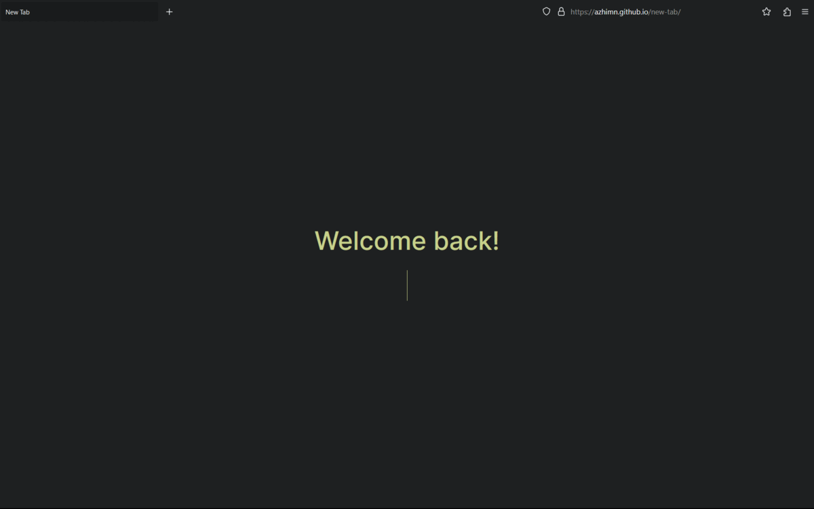

<h3>new-tab</h3>

  Repository for my custom <a href="https://www.mozilla.org/firefox">Firefox</a> home page & new tab page.  

  Heavily inspired by <a href="https://github.com/KorySchneider/tab">KorySchneider/tab</a>.

<h3>Preview</h3>

  In this preview, I use <a href="https://github.com/andreasgrafen/cascade">andreasgrafen/cascade</a> as <a href="https://www.mozilla.org/firefox">Firefox</a> userChrome.css theme.

<h3>Commands</h3>

new-tab support commands.

As of now, only commands that opens or searches certain websites are supported.

<ul>
  <li>
    <code>!arch</code> To open <a href="https://archlinux.org">Arch Linux website</a> or search <a href="https://wiki.archlinux.org">Arch Linux Wiki</a>
  </li>
  <li>
    <code>!gh</code> To open or search <a href="https://github.com">GitHub</a>
  </li>
  <li>
    <code>!gm</code> To open or search <a href="https://mail.google.com">Gmail</a>
  </li>
  <li>
    <code>!w</code> To open or search <a href="https://wikipedia.org">Wikipedia</a>
  </li>
  <li>
    <code>!yt</code> To open or search <a href="https://youtube.com">YouTube</a>.
  </li>
</ul>